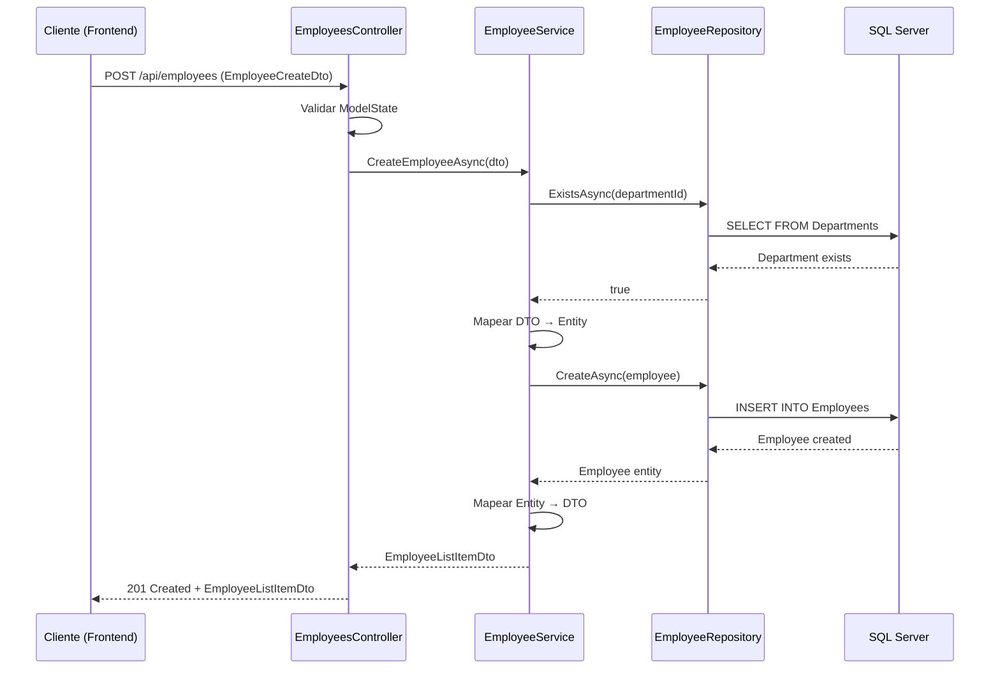

# SGE Backend - Resumen Técnico

## 1. Información General del Proyecto

**Nombre del proyecto:** Sistema de Gestión de Empleados (SGE API)

**Propósito:** API backend desarrollada en .NET 8 para administrar empleados y departamentos, proporcionando operaciones CRUD completas con funcionalidades avanzadas de búsqueda, paginación y ordenamiento.

**Tecnologías utilizadas:**
- **.NET 8.0** - Framework principal de desarrollo
- **C#** - Lenguaje de programación
- **Entity Framework Core 8.0.18** - ORM para acceso a datos
- **SQL Server** - Sistema de gestión de base de datos
- **Swagger/OpenAPI** - Documentación interactiva de la API
- **Docker** - Contenerización de la aplicación
- **ASP.NET Core Web API** - Framework para APIs REST
- **Inyección de Dependencias** - Patrón de inversión de control
- **Data Annotations** - Validaciones de modelo
- **xUnit & Moq** - Framework de pruebas unitarias

**Contexto de ejecución:** API REST que sirve como backend para la aplicación frontend `sge-app` (Ionic/Angular), comunicándose a través de HTTP con soporte para CORS configurado específicamente para el puerto 8100.

---

## 2. Arquitectura del Proyecto

### 2.1 Tipo de Arquitectura Implementada

El proyecto implementa una **Arquitectura Limpia (Clean Architecture)** siguiendo los principios de separación de responsabilidades y el principio de inversión de dependencias. Esta arquitectura se organiza en cuatro capas principales con dependencias unidireccionales.

### 2.2 Estructura de Capas

```
┌─────────────────────────────────────────────────────────┐
│                    🌐 SGE.Api                          │
│              (Presentation Layer)                       │
│  Controllers │ Program.cs │ Swagger │ CORS              │
└─────────────────────┬───────────────────────────────────┘
                      │ depends on ⬇️
┌─────────────────────▼───────────────────────────────────┐
│               🔧 SGE.Application                        │
│               (Application Layer)                       │
│     Services │ DTOs │ Business Logic                    │
└─────────────────────┬───────────────────────────────────┘
                      │ depends on ⬇️
┌─────────────────────▼───────────────────────────────────┐
│                🎯 SGE.Domain                            │
│                (Domain Layer)                           │
│     Entities │ Interfaces │ Core Logic                  │
└─────────────────────┬───────────────────────────────────┘
                      │ implemented by ⬆️
┌─────────────────────▼───────────────────────────────────┐
│             🗄️ SGE.Infrastructure                      │
│             (Infrastructure Layer)                      │
│   EF Core │ Repositories │ Database Context │ Migrations │
└─────────────────────────────────────────────────────────┘
```

### 2.3 Propósito de Cada Capa

#### 🎯 Domain Layer (SGE.Domain)
- **Entidades:** `Employee`, `Department` - Modelos de dominio centrales
- **Contratos:** `IEmployeeRepository`, `IDepartmentRepository` - Interfaces que definen operaciones de datos
- **Propósito:** Define la estructura central del negocio sin dependencias externas, estableciendo las reglas de negocio fundamentales

#### 🔧 Application Layer (SGE.Application)
- **Servicios:** `EmployeeService`, `DepartmentService` - Orquestación de lógica de negocio
- **DTOs:** `EmployeeCreateDto`, `EmployeeUpdateDto`, `EmployeeListItemDto`, `PagedResult` - Objetos de transferencia de datos
- **Interfaces:** `IEmployeeService`, `IDepartmentService` - Contratos de servicios de aplicación
- **Propósito:** Coordina la lógica de negocio, transforma datos entre capas y actúa como intermediario entre la presentación y el dominio

#### 🗄️ Infrastructure Layer (SGE.Infrastructure)
- **Persistencia:** `SgeDbContext` - Contexto de Entity Framework Core
- **Repositorios:** `EmployeeRepository`, `DepartmentRepository` - Implementaciones concretas de acceso a datos
- **Migraciones:** Control automático del esquema de base de datos
- **Seed:** `DatabaseSeeder` - Población inicial de datos
- **Propósito:** Implementa la persistencia de datos y proporciona acceso a recursos externos

#### 🌐 API Layer (SGE.Api)
- **Controladores:** `EmployeesController`, `DepartmentsController` - Endpoints HTTP
- **Configuración:** `Program.cs` - Configuración de servicios, DI, CORS y middleware
- **Propósito:** Expone la funcionalidad como endpoints HTTP RESTful y maneja la comunicación externa

### 2.4 Gestión de Dependencias

Las dependencias siguen un flujo estricto hacia adentro:
- **SGE.Api** → SGE.Application + SGE.Infrastructure
- **SGE.Application** → SGE.Domain
- **SGE.Infrastructure** → SGE.Domain
- **SGE.Domain** → Sin dependencias externas

---

## 3. Patrones de Diseño Utilizados

### 3.1 Repository Pattern
**Implementación:** Capa `SGE.Infrastructure`

El patrón Repository abstrae el acceso a datos proporcionando una interfaz uniforme para operaciones CRUD:

```csharp
// Interfaz en Domain
public interface IEmployeeRepository
{
    Task<IEnumerable<Employee>> GetAllAsync(string? query = null, int page = 1, 
        int pageSize = 10, string orderBy = "FullName", bool desc = false);
    Task<Employee?> GetByIdAsync(int id);
    Task<Employee> CreateAsync(Employee employee);
    Task<Employee> UpdateAsync(Employee employee);
    Task<bool> DeleteAsync(int id);
}

// Implementación en Infrastructure
public class EmployeeRepository : IEmployeeRepository
{
    private readonly SgeDbContext _context;
    // Implementación con Entity Framework Core
}
```

### 3.2 Dependency Injection Pattern
**Implementación:** `Program.cs`

Configuración de inversión de control que desacopla las dependencias:

```csharp
// Repositorios
builder.Services.AddScoped<IEmployeeRepository, EmployeeRepository>();
builder.Services.AddScoped<IDepartmentRepository, DepartmentRepository>();

// Servicios de aplicación
builder.Services.AddScoped<IEmployeeService, EmployeeService>();
builder.Services.AddScoped<IDepartmentService, DepartmentService>();
```

### 3.3 DTO/Data Transfer Object Pattern
**Implementación:** Capa `SGE.Application`

Separación clara entre entidades de dominio y objetos de transferencia:

```csharp
public class EmployeeCreateDto
{
    [Required(ErrorMessage = "El nombre completo es requerido")]
    [StringLength(120, ErrorMessage = "El nombre no puede exceder 120 caracteres")]
    public string FullName { get; set; } = string.Empty;
    
    [Required]
    [Range(0, double.MaxValue)]
    public decimal Salary { get; set; }
    // ... más propiedades con validaciones
}
```

### 3.4 Service Layer Pattern
**Implementación:** `EmployeeService`, `DepartmentService`

Encapsula la lógica de negocio y coordina operaciones entre repositorios:

```csharp
public class EmployeeService : IEmployeeService
{
    private readonly IEmployeeRepository _employeeRepository;
    private readonly IDepartmentRepository _departmentRepository;

    public async Task<EmployeeListItemDto> CreateEmployeeAsync(EmployeeCreateDto dto)
    {
        // Validación de negocio
        if (!await _departmentRepository.ExistsAsync(dto.DepartmentId))
            throw new ArgumentException($"El departamento con ID {dto.DepartmentId} no existe");
        
        // Transformación y persistencia
        var employee = new Employee { /* mapeo */ };
        var created = await _employeeRepository.CreateAsync(employee);
        return /* mapeo a DTO */;
    }
}
```

### 3.5 Unit of Work Pattern (Implícito)
**Implementación:** Entity Framework Core DbContext

El `SgeDbContext` actúa como Unit of Work, coordinando transacciones y seguimiento de cambios automáticamente.

### 3.6 Factory Pattern (Implícito)
**Implementación:** Entity Framework Core y ASP.NET Core

Creación automática de instancias de contextos y servicios a través del contenedor de DI.

---

## 4. Principios SOLID Aplicados

### 4.1 Single Responsibility Principle
Cada clase tiene una responsabilidad específica y bien definida:

- **`EmployeeController`:** Maneja únicamente peticiones HTTP relacionadas con empleados
- **`EmployeeService`:** Se encarga exclusivamente de la lógica de negocio de empleados
- **`EmployeeRepository`:** Responsable solo del acceso a datos de empleados
- **`SgeDbContext`:** Configura y maneja únicamente el contexto de base de datos

### 4.2 Open/Closed Principle
El sistema está abierto para extensión pero cerrado para modificación:

```csharp
// Extensible sin modificar código existente
public interface IEmployeeRepository
{
    // Métodos base
}

// Nuevas funcionalidades se pueden agregar implementando interfaces
public class AdvancedEmployeeRepository : IEmployeeRepository
{
    // Implementación extendida
}
```

### 4.3 Liskov Substitution Principle
Las implementaciones son completamente intercambiables con sus interfaces:

```csharp
// Cualquier implementación de IEmployeeService puede sustituir a otra
IEmployeeService service = new EmployeeService(/*..*/);
// O en el futuro: new CachedEmployeeService(/*..*/);
```

### 4.4 Interface Segregation Principle
Interfaces específicas y cohesivas evitan dependencias innecesarias:

```csharp
// Interfaces separadas por responsabilidad
public interface IEmployeeRepository { /* solo métodos de Employee */ }
public interface IDepartmentRepository { /* solo métodos de Department */ }
```

### 4.5 Dependency Inversion Principle
Las capas superiores dependen de abstracciones, no de implementaciones concretas:

```csharp
public class EmployeeService : IEmployeeService
{
    // Depende de abstracciones, no de implementaciones concretas
    private readonly IEmployeeRepository _employeeRepository;
    private readonly IDepartmentRepository _departmentRepository;
}
```

---

## 5. Flujo de Datos y Comunicación

### 5.1 Flujo de una Operación CRUD Completa



### 5.2 Métodos Principales de los Controladores

#### EmployeesController:
- **GET `/api/employees`** - Lista paginada con filtros opcionales
- **GET `/api/employees/{id}`** - Obtiene empleado por ID
- **POST `/api/employees`** - Crea nuevo empleado
- **PUT `/api/employees/{id}`** - Actualiza empleado existente
- **DELETE `/api/employees/{id}`** - Elimina empleado

#### DepartmentsController:
- **GET `/api/departments`** - Lista todos los departamentos

### 5.3 Funcionalidades Avanzadas

**Paginación y Filtrado:**
```csharp
public async Task<ActionResult<PagedResult<EmployeeListItemDto>>> GetEmployees(
    [FromQuery] string? query = null,      // Búsqueda por ID o nombre
    [FromQuery] int page = 1,              // Página actual
    [FromQuery] int pageSize = 10,         // Elementos por página
    [FromQuery] string orderBy = "FullName", // Campo de ordenamiento
    [FromQuery] bool desc = false)         // Orden descendente
```

**Validación de Negocio:**
- Verificación de existencia de departamentos antes de crear/actualizar empleados
- Validaciones de modelo con Data Annotations
- Manejo de errores con ProblemDetails

---

## 6. Persistencia y Base de Datos

### 6.1 Configuración del Contexto

```csharp
public class SgeDbContext : DbContext
{
    public DbSet<Employee> Employees => Set<Employee>();
    public DbSet<Department> Departments => Set<Department>();

    protected override void OnModelCreating(ModelBuilder modelBuilder)
    {
        // Configuración de Department
        modelBuilder.Entity<Department>(e =>
        {
            e.ToTable("Departments");
            e.HasKey(x => x.Id);
            e.Property(x => x.Name).IsRequired().HasMaxLength(80);
            e.HasIndex(x => x.Name).IsUnique();
        });
        
        // Configuración de Employee
        modelBuilder.Entity<Employee>(e =>
        {
            e.ToTable("Employees", t =>
            {
                t.HasCheckConstraint("CK_Employees_Salary", "[Salary] >= 0");
            });
            e.Property(x => x.Salary).HasColumnType("decimal(18,2)");
            e.HasOne(x => x.Department)
                .WithMany(d => d.Employees)
                .HasForeignKey(x => x.DepartmentId)
                .OnDelete(DeleteBehavior.Restrict);
        });
    }
}
```

### 6.2 Entidades y Relaciones

```csharp
public class Employee
{
    public int Id { get; set; }
    public string FullName { get; set; } = string.Empty;
    public DateTime HireDate { get; set; }
    public string Role { get; set; } = string.Empty;
    public decimal Salary { get; set; }
    public int DepartmentId { get; set; }
    public Department Department { get; set; } = null!;
}

public class Department
{
    public int Id { get; set; }
    public string Name { get; set; } = string.Empty;
    public ICollection<Employee> Employees { get; set; } = new List<Employee>();
}
```

### 6.3 Migraciones Entity Framework Core

El proyecto utiliza Code-First con migraciones automáticas:
- **`20251104191207_Initial.cs`** - Migración inicial que crea las tablas base
- **`SgeDbContextModelSnapshot.cs`** - Snapshot del modelo actual

### 6.4 Estructura de Base de Datos Generada

```sql
-- Tabla Departments
CREATE TABLE [Departments] (
    [Id] int NOT NULL IDENTITY,
    [Name] nvarchar(80) NOT NULL,
    CONSTRAINT [PK_Departments] PRIMARY KEY ([Id]),
    CONSTRAINT [IX_Departments_Name] UNIQUE ([Name])
);

-- Tabla Employees
CREATE TABLE [Employees] (
    [Id] int NOT NULL IDENTITY,
    [FullName] nvarchar(120) NOT NULL,
    [HireDate] datetime2 NOT NULL,
    [Role] nvarchar(80) NOT NULL,
    [Salary] decimal(18,2) NOT NULL,
    [DepartmentId] int NOT NULL,
    CONSTRAINT [PK_Employees] PRIMARY KEY ([Id]),
    CONSTRAINT [FK_Employees_Departments_DepartmentId] 
        FOREIGN KEY ([DepartmentId]) REFERENCES [Departments] ([Id]) ON DELETE RESTRICT,
    CONSTRAINT [CK_Employees_Salary] CHECK ([Salary] >= 0)
);
```

### 6.5 Configuración de Conexión

**appsettings.json/appsettings.Development.json:**
```json
{
  "ConnectionStrings": {
    "Default": "Server=localhost,1433;Database=SGE;User Id=sa;Password=***;MultipleActiveResultSets=True;TrustServerCertificate=True;"
  }
}
```

**Configuración en Program.cs:**
```csharp
builder.Services.AddDbContext<SgeDbContext>(options =>
    options.UseSqlServer(builder.Configuration.GetConnectionString("Default")));
```

---

## 7. Configuración, Servicios e Inyección de Dependencias

### 7.1 Configuración Principal en Program.cs

```csharp
var builder = WebApplication.CreateBuilder(args);
var cors = "_sgeCors";

// Servicios básicos de ASP.NET Core
builder.Services.AddControllers();
builder.Services.AddEndpointsApiExplorer();
builder.Services.AddSwaggerGen();

// Configuración CORS específica para frontend Ionic
builder.Services.AddCors(o => o.AddPolicy(cors, p =>
    p.WithOrigins("http://localhost:8100")
     .AllowAnyHeader()
     .AllowAnyMethod()
));

// ProblemDetails para manejo estandarizado de errores
builder.Services.AddProblemDetails();

// Entity Framework Core
builder.Services.AddDbContext<SgeDbContext>(options =>
    options.UseSqlServer(builder.Configuration.GetConnectionString("Default")));

// Registro de Repositorios (Scoped)
builder.Services.AddScoped<IEmployeeRepository, EmployeeRepository>();
builder.Services.AddScoped<IDepartmentRepository, DepartmentRepository>();

// Registro de Servicios de Aplicación (Scoped)
builder.Services.AddScoped<IEmployeeService, EmployeeService>();
builder.Services.AddScoped<IDepartmentService, DepartmentService>();
```

### 7.2 Configuración del Pipeline de Middleware

```csharp
var app = builder.Build();

// Seed inicial de datos
using (var scope = app.Services.CreateScope())
{
    var db = scope.ServiceProvider.GetRequiredService<SgeDbContext>();
    await DatabaseSeeder.SeedAsync(db);
}

// Pipeline de middleware
app.UseSwagger();           // Documentación OpenAPI
app.UseSwaggerUI();         // Interfaz interactiva
app.UseHttpsRedirection();  // Redirección HTTPS
app.UseCors(cors);          // Políticas CORS
app.UseExceptionHandler();  // Manejo global de excepciones
app.MapControllers();       // Mapeo de controladores

app.Run();
```

### 7.3 Beneficios de la Configuración

**Mantenibilidad:**
- Configuración centralizada en un solo punto
- Separación clara entre configuración de desarrollo y producción
- Gestión automática del ciclo de vida de objetos

**Testabilidad:**
- Todas las dependencias son inyectables
- Fácil creación de mocks para pruebas unitarias
- Aislamiento de componentes

**Extensibilidad:**
- Nuevos servicios se registran fácilmente
- Decoradores y proxies se pueden agregar sin modificar código existente

---

## 8. Seguridad, Validaciones y Manejo de Errores

### 8.1 Validaciones de Modelo

**Data Annotations en DTOs:**
```csharp
public class EmployeeCreateDto
{
    [Required(ErrorMessage = "El nombre completo es requerido")]
    [StringLength(120, ErrorMessage = "El nombre no puede exceder 120 caracteres")]
    public string FullName { get; set; } = string.Empty;

    [Required(ErrorMessage = "El salario es requerido")]
    [Range(0, double.MaxValue, ErrorMessage = "El salario debe ser mayor o igual a 0")]
    public decimal Salary { get; set; }

    [Required(ErrorMessage = "El departamento es requerido")]
    public int DepartmentId { get; set; }
}
```

**Validación en Controladores:**
```csharp
[HttpPost]
public async Task<ActionResult<EmployeeListItemDto>> CreateEmployee([FromBody] EmployeeCreateDto dto)
{
    if (!ModelState.IsValid)
    {
        return BadRequest(ModelState);
    }
    // ... resto de la lógica
}
```

### 8.2 Validaciones de Negocio

**Validación en Servicios:**
```csharp
public async Task<EmployeeListItemDto> CreateEmployeeAsync(EmployeeCreateDto dto)
{
    // Validación de existencia de departamento
    if (!await _departmentRepository.ExistsAsync(dto.DepartmentId))
    {
        throw new ArgumentException($"El departamento con ID {dto.DepartmentId} no existe");
    }
    // ... resto de la lógica
}
```

### 8.3 Manejo Global de Errores

**ProblemDetails Implementation:**
```csharp
// Configuración en Program.cs
builder.Services.AddProblemDetails();
app.UseExceptionHandler();

// Uso en controladores
return NotFound(new ProblemDetails
{
    Title = "Empleado no encontrado",
    Detail = $"No se encontró el empleado con ID {id}",
    Status = StatusCodes.Status404NotFound
});
```

### 8.4 Seguridad Implementada

**CORS Policy:**
- Configuración específica para frontend en puerto 8100
- Permite todos los headers y métodos HTTP necesarios

**Validación de Entrada:**
- Sanitización automática de parámetros de consulta
- Límites en paginación (máximo 100 elementos por página)
- Validación de tipos y rangos

### 8.5 Seguridad Recomendada para Producción

**Extensiones Futuras:**
- **Autenticación JWT:** Para identificación de usuarios
- **Autorización por Roles:** Para control de acceso granular
- **Rate Limiting:** Para prevenir abuso de API
- **Logging de Seguridad:** Para auditoría de accesos

```csharp
// Ejemplo de extensión con JWT
builder.Services.AddAuthentication(JwtBearerDefaults.AuthenticationScheme)
    .AddJwtBearer(options => { /* configuración JWT */ });

[Authorize(Roles = "Admin")]
public class EmployeesController : ControllerBase
```

---

## 9. Buenas Prácticas y Mantenibilidad

### 9.1 Separación de Responsabilidades

**Beneficios Implementados:**
- **Controladores Ligeros:** Solo manejan HTTP, delegando lógica a servicios
- **Servicios Enfocados:** Cada servicio maneja un agregado específico
- **Repositorios Específicos:** Acceso a datos optimizado por entidad
- **DTOs Especializados:** Contratos de API separados de entidades de dominio

### 9.2 Código Modular y Extensible

**Características:**
```csharp
// Fácil extensión de funcionalidades
public interface IEmployeeService
{
    // Métodos base existentes
    Task<PagedResult<EmployeeListItemDto>> GetEmployeesAsync(/*...*/);
    
    // Nuevos métodos se pueden agregar sin romper implementaciones existentes
    // Task<EmployeeStatisticsDto> GetEmployeeStatisticsAsync();
}
```

### 9.3 Configuración por Entorno

**Flexibilidad:**
- `appsettings.json` - Configuración base
- `appsettings.Development.json` - Configuración de desarrollo
- `appsettings.Production.json` - Configuración de producción (no incluido)
- Variables de entorno para secretos sensibles

### 9.4 Documentación Automática

**Swagger/OpenAPI:**
- Documentación interactiva automática
- Contratos de API siempre actualizados
- Facilita integración con frontend
- Pruebas rápidas durante desarrollo

### 9.5 Consistencia en el Código

**Estándares Aplicados:**
- Convenciones de nomenclatura C# consistentes
- Uso de `async/await` en todas las operaciones I/O
- Manejo consistente de nullabilidad
- Estructura de proyecto estándar .NET

### 9.6 Pruebas Unitarias

**Implementación Actual:**
```csharp
public class EmployeeServiceTests
{
    private readonly Mock<IEmployeeRepository> _mockEmployeeRepo;
    private readonly Mock<IDepartmentRepository> _mockDepartmentRepo;
    private readonly EmployeeService _service;

    [Fact]
    public async Task GetEmployeesAsync_ReturnsPagedResult()
    {
        // Arrange, Act, Assert pattern
    }
}
```

---

## 10. Conclusiones Técnicas

### 10.1 Beneficios de la Arquitectura Implementada

**Clean Architecture Benefits:**
- **Mantenibilidad Superior:** Separación clara de responsabilidades facilita modificaciones aisladas
- **Testabilidad Maximizada:** Dependencias inyectables permiten testing integral con mocks
- **Flexibilidad de Tecnología:** Capas externas pueden cambiar sin afectar la lógica de negocio
- **Escalabilidad Horizontal:** Estructura permite agregar nuevas funcionalidades sin refactoring masivo

### 10.2 Extensibilidad y Escalabilidad

**Puntos Fuertes:**
```csharp
// Fácil adición de nuevas entidades
public interface IProjectRepository { }
public class ProjectService : IProjectService { }
public class ProjectsController : ControllerBase { }

// Extensión de funcionalidades existentes
public class CachedEmployeeService : IEmployeeService
{
    private readonly IEmployeeService _innerService;
    private readonly IMemoryCache _cache;
}
```

**Capacidad de Crecimiento:**
- Patrón Repository permite cambio de ORM sin afectar lógica de negocio
- Services layer permite agregar lógica compleja (workflows, validaciones avanzadas)
- API layer soporta versionado y extensiones RESTful

### 10.3 Facilidad de Mantenimiento

**Ventajas Estructurales:**
- **Bajo Acoplamiento:** Cambios en una capa no afectan otras
- **Alta Cohesión:** Cada componente tiene una responsabilidad clara
- **Principios SOLID:** Código que sigue principios sólidos de diseño
- **Inyección de Dependencias:** Facilita testing y mockeo

### 10.4 Mejoras y Extensiones Futuras

**Recomendaciones de Evolución:**

**Seguridad Avanzada:**
```csharp
// Implementación de autenticación JWT
[Authorize(Policy = "EmployeeManagement")]
public class EmployeesController : ControllerBase

// Auditoría de cambios
public class AuditableEntity
{
    public DateTime CreatedAt { get; set; }
    public string CreatedBy { get; set; }
    public DateTime? ModifiedAt { get; set; }
    public string? ModifiedBy { get; set; }
}
```

**Logging Estructurado:**
```csharp
// Implementación con Serilog
public class EmployeeService : IEmployeeService
{
    private readonly ILogger<EmployeeService> _logger;
    
    public async Task<EmployeeListItemDto> CreateEmployeeAsync(EmployeeCreateDto dto)
    {
        _logger.LogInformation("Creating employee {FullName} in department {DepartmentId}", 
            dto.FullName, dto.DepartmentId);
    }
}
```

**Caching y Performance:**
```csharp
// Cache distribuido para escalabilidad
builder.Services.AddStackExchangeRedisCache(options =>
{
    options.Configuration = "localhost:6379";
});

// Optimizaciones de consultas EF Core
public class EmployeeRepository : IEmployeeRepository
{
    public async Task<IEnumerable<Employee>> GetAllAsync(/*...*/)
    {
        return await _context.Employees
            .AsNoTracking() // Para consultas de solo lectura
            .Include(e => e.Department)
            .Where(/*...*/)
            .ToListAsync();
    }
}
```

**Integración CI/CD:**
- Pipeline automatizado de build y deployment
- Pruebas automatizadas en múltiples entornos
- Análisis estático de código con SonarQube
- Contenedorización completa con Docker Compose

**Monitoreo y Observabilidad:**
- Application Insights para telemetría
- Health checks para estado de la aplicación
- Métricas personalizadas de negocio

### 10.5 Valoración Final

El proyecto SGE API representa una implementación sólida y profesional de Clean Architecture en .NET 8, demostrando:

✅ **Excelente separación de responsabilidades**  
✅ **Aplicación correcta de principios SOLID**  
✅ **Código mantenible y extensible**  
✅ **Buenas prácticas de desarrollo .NET**  
✅ **Documentación automática y testing**  
✅ **Configuración flexible por entornos**  

La arquitectura elegida proporciona una base sólida para el crecimiento futuro y facilita tanto el mantenimiento como la incorporación de nuevas funcionalidades, representando un ejemplo de calidad enterprise para sistemas de gestión de empleados.

---

**Documento generado el:** 5 de noviembre de 2025  
**Versión de la API:** SGE Backend v1.0  
**Tecnología principal:** .NET 8.0 + Entity Framework Core 8.0.18  
**Autor:** Análisis técnico automatizado del proyecto SGE